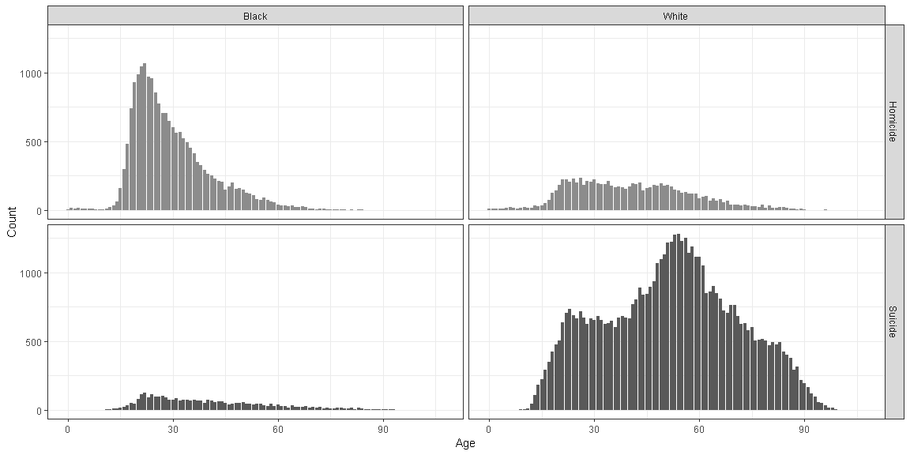
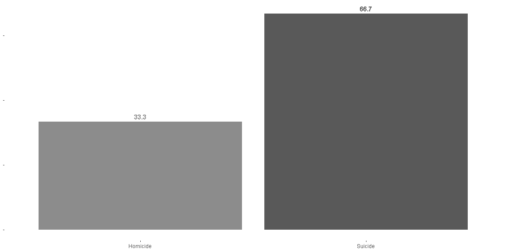
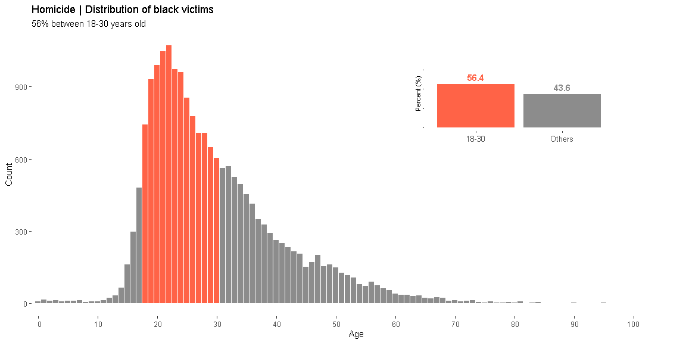
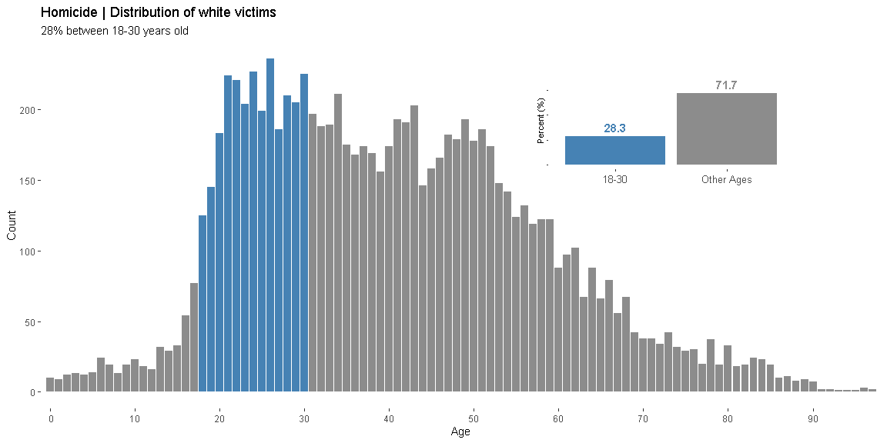
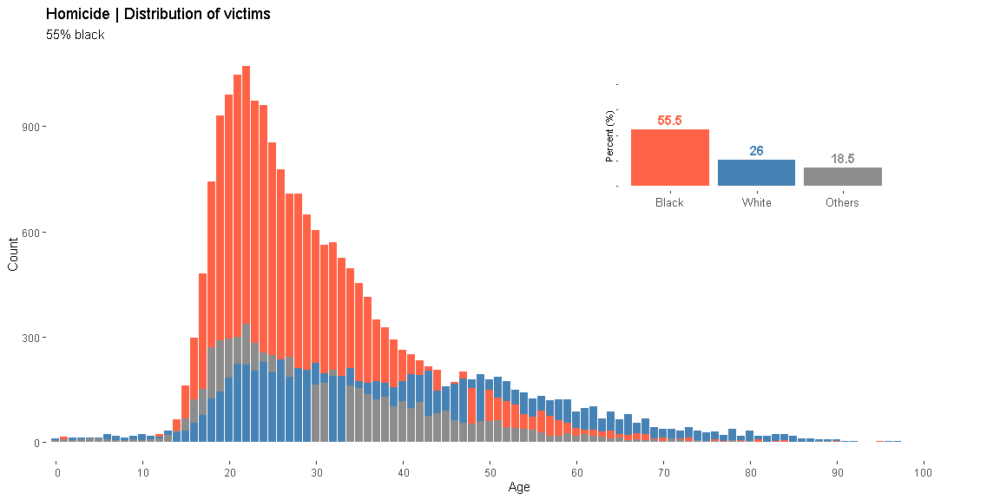
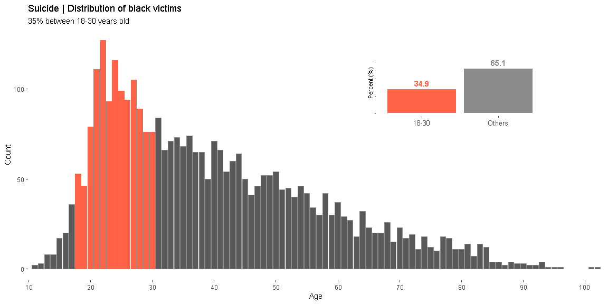
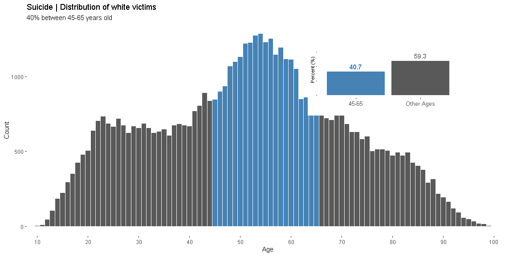
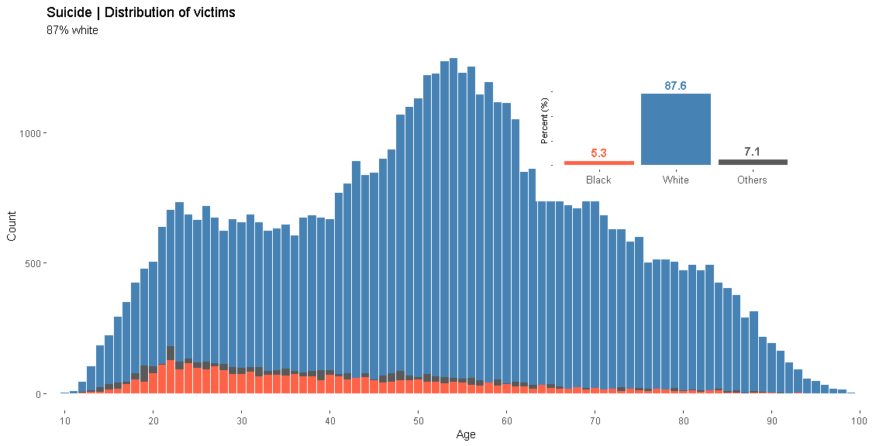

<br>
<br>


#### $100,798$ people were fatally shot in the U.S. between 2012 and 2014.

The data in this project comes from [FiveThirtyEight](https://fivethirtyeight.com), which is derived from death certificates from all U.S.


```r
gun %>%
  filter(race %in% c("Black", "White")
         & intent %in% c("Homicide", "Suicide")) %>%
  ggplot(aes(age, fill = intent)) +
  geom_histogram(stat = "count") +
  scale_fill_manual(values = c("gray55", "gray35"), guide = F) +
  labs(x = "Age", y = "Count") +
  facet_grid(intent~race) +
  theme_bw()
```

<!-- -->
<br>
<br>
<br>
<br>

#### $66.7%$ of gun deaths are suicides


```r
homicide <- gun %>% 
  filter(intent == "Homicide") %>% 
  nrow()

suicide <- gun %>% 
  filter(intent == "Suicide") %>% 
  nrow()

n <- c(homicide, suicide)
intent <- c("Homicide", "Suicide")

death <- as.data.frame(cbind(n, intent))
death <- death %>%
  mutate(n = as.numeric(n)) %>%
  mutate(percent = (n / sum(n)) * 100)


death %>%
  ggplot(aes(intent, percent, fill = intent)) +
  geom_bar(stat = "identity") +
  scale_fill_manual(values = c("gray55", "gray35"), guide = F) +
  geom_text(aes(label = round(percent, 1))
            ,position = position_dodge(width = 1)
            ,vjust = -0.5, family = "sans", color = c("gray55", "gray35"), fontface = "bold") +
  theme(panel.background = element_blank()
        ,axis.text.y = element_blank()
        ,axis.title = element_blank())
```

<!-- -->


<br>
<br>
<br>
<br>
<br>


## Homicides

#### Age x Race


```r
# BLACK

gun.black.youth <- gun %>%
  filter(race == "Black" 
         #& sex == "M"
         & intent == "Homicide"
         & !is.na(age)) %>%
  mutate(youth = ifelse(age >= 18 & age <= 30, "18-30", "Others")) %>%
  group_by(youth) %>%
  mutate(count = n())

## Creating percentages

gun.black.youth.percent <- gun.black.youth %>%
  group_by(youth) %>%
  select(youth, count) %>%
  unique() %>%
  ungroup() %>%
  mutate(percent = count / sum(count) * 100)

gun.black.youth.2 <- gun.black.youth %>%
  left_join(gun.black.youth.percent, by = "youth") %>%
  mutate(percent = round(percent, 1)) %>%
  rename(count = count.x) %>%
  select(-count.y)
##

options(scipen=999) # Avoid scientific notation

a <- gun.black.youth.2 %>%
  ggplot(aes(age)) +
  geom_histogram(stat = "count", fill = "gray55") +
  geom_histogram(stat = "count", data = gun.black.youth.2 %>% filter(youth == "18-30"), fill = "tomato") +
  scale_x_discrete(limits = c(seq(0, max(gun.black.youth.2$age), 10))) +
  labs(title = "Homicide | Distribution of black victims"
       ,subtitle = "56% between 18-30 years old"
       ,x = "Age", y = "Count") +
  theme(panel.background = element_blank())

b <- gun.black.youth.percent %>%
  ggplot(aes(youth, percent)) +
  geom_col(aes(fill = factor(youth))) +
  theme(axis.text.x = element_text(size = 10)
        ,axis.text.y = element_blank()
        ,panel.background = element_blank()) +
  scale_fill_manual(values = c("tomato", "gray55"), guide = F) +
  #scale_x_discrete(limits = rev(levels(factor(gun.black.youth$youth)))) +
  geom_text(data = gun.black.youth.2 %>% filter(youth == "18-30")
            ,aes(label = percent)
            ,position = position_dodge(width = 1)
            ,vjust = -0.5, family = "sans", color = "tomato", fontface = "bold") +
  geom_text(data = gun.black.youth.2 %>% filter(youth != "18-30")
            ,aes(label = percent)
            ,position = position_dodge(width = 1)
            ,vjust = -0.5, family = "sans", color = "gray55", fontface = "bold") +
  ylim(0, 90) +
  labs(x = "", y = "Percent (%)")


vp <- grid::viewport(width = 0.3, height = 0.3, just = c("centre",
         "centre"), x = 0.75, y = 0.7)

full <- function() {
     print(a)
     theme_set(theme_gray(base_size = 8))
     theme_gray()
     print(b, vp = vp)
     theme_set(theme_gray())
}
full()
```

<!-- -->

<br>
<br>


```r
# White

gun.white.youth <- gun %>%
  filter(race == "White" 
         #& sex == "M"
         & intent == "Homicide"
         & !is.na(age)) %>%
  mutate(youth = ifelse(age >= 18 & age <= 30, "18-30", "Other Ages")) %>%
  group_by(youth) %>%
  mutate(count = n())

## Creating percentages

gun.white.youth.percent <- gun.white.youth %>%
  group_by(youth) %>%
  select(youth, count) %>%
  unique() %>%
  ungroup() %>%
  mutate(percent = count / sum(count) * 100)

gun.white.youth.2 <- gun.white.youth %>%
  left_join(gun.white.youth.percent, by = "youth") %>%
  mutate(percent = round(percent, 1)) %>%
  rename(count = count.x) %>%
  select(-count.y)


a <- gun.white.youth.2 %>%
  ggplot(aes(age)) +
  geom_histogram(stat = "count", fill = "gray55") +
  geom_histogram(stat = "count", data = gun.white.youth.2 %>% filter(youth == "18-30"), fill = "steelblue") +
  scale_x_discrete(limits = c(seq(0, max(gun.white.youth.2$age), 10))) +
  labs(title = "Homicide | Distribution of white victims"
       ,subtitle = "28% between 18-30 years old"
       ,x = "Age", y = "Count") +
  theme(panel.background = element_blank())


b <- gun.white.youth.percent %>%
  ggplot(aes(youth, percent)) +
  geom_col(aes(fill = factor(youth))) +
  theme(axis.text.x = element_text(size = 10) 
        ,axis.text.y = element_blank()
        ,panel.background = element_blank()) +
  scale_fill_manual(values = c("steelblue", "gray55"), guide = F) +
  #scale_x_discrete(limits = rev(levels(factor(gun.white.youth$youth)))) +
  geom_text(data = gun.white.youth.2 %>% filter(youth == "18-30")
            ,aes(label = percent)
            ,position = position_dodge(width = 1)
            ,vjust = -0.5, family = "sans", color = "steelblue", fontface = "bold") +
  geom_text(data = gun.white.youth.2 %>% filter(youth != "18-30")
            ,aes(label = percent)
            ,position = position_dodge(width = 1)
            ,vjust = -0.5, family = "sans", color = "gray55", fontface = "bold") +
  ylim(0, 90) +
  labs(x = "", y = "Percent (%)")


vp <- grid::viewport(width = 0.3, height = 0.3, just = c("centre",
         "centre"), x = 0.75, y = 0.7)

full <- function() {
     print(a)
     theme_set(theme_gray(base_size = 8))
     theme_gray()
     print(b, vp = vp)
     theme_set(theme_gray())
}
full()
```

<!-- -->

<br>
<br>
<br>
<br>


```r
# BLACK x WHITE

gun.both.youth <- gun %>%
  filter(#sex == "M" & 
         intent == "Homicide") %>%
  mutate(youth = ifelse(race == "Black", "Black"
                 ,ifelse(race == "White", "White", "Others"))) %>%
  group_by(youth) %>%
  mutate(count = n())

## Creating percentages

gun.both.youth.percent <- gun.both.youth %>%
  group_by(youth) %>%
  select(youth, count) %>%
  unique() %>%
  ungroup() %>%
  mutate(percent = count / sum(count) * 100
        ,youth.levels = ifelse(youth == "Black", 1
                       ,ifelse(youth == "White", 2, 3))) %>%
  group_by(youth, youth.levels)


gun.both.youth.2 <- gun.both.youth %>%
  left_join(gun.both.youth.percent, by = "youth") %>%
  mutate(percent = round(percent, 1)) %>%
  rename(count = count.x
         ,youth = youth) %>%
  select(-count.y, -youth)
##


a <- gun.both.youth.2 %>%
  ggplot(aes(age)) +
  geom_histogram(stat = "count", data = gun.both.youth.2 %>% filter(youth == "Black"), fill = "tomato") +
  geom_histogram(stat = "count", data = gun.both.youth.2 %>% filter(youth == "White"), fill = "steelblue") +
  geom_histogram(stat = "count", data = gun.both.youth.2 %>% filter(youth == "Others"), fill = "gray55") +
  geom_histogram(stat = "count", data = gun.both.youth.2 %>% filter(youth == "White" & (age >= 14 & age <= 29 | age %in% c(32,33))), fill = "steelblue") +
  geom_histogram(stat = "count", data = gun.both.youth.2 %>% filter(youth == "Black" & (age >= 50 & age <= 91 | age %in% c(48))), fill = "tomato") +
  geom_histogram(stat = "count", data = gun.both.youth.2 %>% filter(youth == "Others" & (age >= 50 & age <= 91 | age %in% c(48))), fill = "gray55") +
  scale_x_discrete(limits = c(seq(0, 100, 10))) +
  labs(title = "Homicide | Distribution of victims"
       ,subtitle = "55% black"
       ,x = "Age", y = "Count") +
  theme(panel.background = element_blank())


b <- gun.both.youth.percent %>%
  ggplot(aes(x = reorder(youth, youth.levels), y = percent)) +
  geom_col(aes(fill = factor(youth))) +
  theme(axis.text.x = element_text(size = 10) 
        ,axis.text.y = element_blank()
        ,panel.background = element_blank()) +
  scale_fill_manual(values = c("tomato", "gray55", "steelblue"), guide = F) +
  geom_text(data = gun.both.youth.percent # %>% filter(youth == "Black Young Men")
            ,aes(label = round(percent, 1))
            ,position = position_dodge(width = 1)
            ,vjust = -0.5, family = "sans", color = c("tomato", "steelblue", "gray55"), fontface = "bold") +
  ylim(0, 100) +
  labs(x = "", y = "Percent (%)")


vp <- grid::viewport(width = 0.3, height = 0.3, just = c("centre",
         "centre"), x = 0.75, y = 0.7)

full <- function() {
     print(a)
     theme_set(theme_gray(base_size = 8))
     theme_gray()
     print(b, vp = vp)
     theme_set(theme_gray())
}
full()
```

<!-- -->

<br>
<br>
<br>
<br>
<br>
<br>
<br>
<br>


## Suicides

#### Age x Race


```r
# BLACK

gun.black.youth <- gun %>%
  filter(race == "Black" 
         #& sex == "M"
         & intent == "Suicide"
         & !is.na(age)) %>%
  mutate(youth = ifelse(age >= 18 & age <= 30, "18-30", "Others")) %>%
  group_by(youth) %>%
  mutate(count = n())

## Creating percentages

gun.black.youth.percent <- gun.black.youth %>%
  group_by(youth) %>%
  select(youth, count) %>%
  unique() %>%
  ungroup() %>%
  mutate(percent = count / sum(count) * 100)

gun.black.youth.2 <- gun.black.youth %>%
  left_join(gun.black.youth.percent, by = "youth") %>%
  mutate(percent = round(percent, 1)) %>%
  rename(count = count.x) %>%
  select(-count.y)
##

options(scipen=999) # Avoid scientific notation

a <- gun.black.youth.2 %>%
  ggplot(aes(age)) +
  geom_histogram(stat = "count", color = "gray55") +
  geom_histogram(stat = "count", data = gun.black.youth.2 %>% filter(youth == "18-30"), fill = "tomato") +
  scale_x_discrete(limits = c(seq(0, max(gun.black.youth.2$age), 10))) +
  labs(title = "Suicide | Distribution of black victims"
       ,subtitle = "35% between 18-30 years old"
       ,x = "Age", y = "Count") +
  theme(panel.background = element_blank())


b <- gun.black.youth.percent %>%
  ggplot(aes(youth, percent)) +
  geom_col(aes(fill = factor(youth))) +
  theme(axis.text.x = element_text(size = 10)
        ,axis.text.y = element_blank()
        ,panel.background = element_blank()) +
  scale_fill_manual(values = c("tomato", "gray55"), guide = F) +
  #scale_x_discrete(limits = rev(levels(factor(gun.black.youth$youth)))) +
  geom_text(data = gun.black.youth.2 %>% filter(youth == "18-30")
            ,aes(label = percent)
            ,position = position_dodge(width = 1)
            ,vjust = -0.5, family = "sans", color = "tomato", fontface = "bold") +
  geom_text(data = gun.black.youth.2 %>% filter(youth != "18-30")
            ,aes(label = percent)
            ,position = position_dodge(width = 1)
            ,vjust = -0.5, family = "sans", color = "gray55", fontface = "bold") +
  ylim(0, 90) +
  labs(x = "", y = "Percent (%)")


vp <- grid::viewport(width = 0.3, height = 0.3, just = c("centre",
         "centre"), x = 0.75, y = 0.7)

full <- function() {
     print(a)
     theme_set(theme_gray(base_size = 8))
     theme_gray()
     print(b, vp = vp)
     theme_set(theme_gray())
}
full()
```

<!-- -->

<br>
<br>


```r
# White

gun.white.youth <- gun %>%
  filter(race == "White" 
        # & sex == "M"
         & intent == "Suicide"
         & !is.na(age)) %>%
  mutate(youth = ifelse(age >= 45 & age <= 65, "45-65", "Other Ages")) %>%
  group_by(youth) %>%
  mutate(count = n())

## Creating percentages

gun.white.youth.percent <- gun.white.youth %>%
  group_by(youth) %>%
  select(youth, count) %>%
  unique() %>%
  ungroup() %>%
  mutate(percent = count / sum(count) * 100)

gun.white.youth.2 <- gun.white.youth %>%
  left_join(gun.white.youth.percent, by = "youth") %>%
  mutate(percent = round(percent, 1)) %>%
  rename(count = count.x) %>%
  select(-count.y)


a <- gun.white.youth.2 %>%
  ggplot(aes(age)) +
  geom_histogram(stat = "count", fill = "gray35") +
  geom_histogram(stat = "count", data = gun.white.youth.2 %>% filter(youth == "45-65"), fill = "steelblue") +
  scale_x_discrete(limits = c(seq(0, max(gun.white.youth.2$age), 10))) +
  labs(title = "Suicide | Distribution of white victims"
       ,subtitle = "40% between 45-65 years old"
       ,x = "Age", y = "Count") +
  theme(panel.background = element_blank())


b <- gun.white.youth.percent %>%
  ggplot(aes(youth, percent)) +
  geom_col(aes(fill = factor(youth))) +
  theme(axis.text.x = element_text(size = 10)
        ,axis.text.y = element_blank()
        ,panel.background = element_blank()) +
  scale_fill_manual(values = c("steelblue", "gray35"), guide = F) +
  #scale_x_discrete(limits = rev(levels(factor(gun.white.youth$youth)))) +
  geom_text(data = gun.white.youth.2 %>% filter(youth == "45-65")
            ,aes(label = percent)
            ,position = position_dodge(width = 1)
            ,vjust = -0.5, family = "sans", color = "steelblue", fontface = "bold") +
  geom_text(data = gun.white.youth.2 %>% filter(youth != "45-65")
            ,aes(label = percent)
            ,position = position_dodge(width = 1)
            ,vjust = -0.5, family = "sans", color = "gray55", fontface = "bold") +
  ylim(0, 90) +
  labs(x = "", y = "Percent (%)")


vp <- grid::viewport(width = 0.3, height = 0.3, just = c("centre",
         "centre"), x = 0.75, y = 0.7)

full <- function() {
     print(a)
     theme_set(theme_gray(base_size = 8))
     theme_gray()
     print(b, vp = vp)
     theme_set(theme_gray())
}
full()
```

<!-- -->

<br>
<br>
<br>
<br>


```r
# BLACK x WHITE

gun.both.youth <- gun %>%
  filter(#sex == "M"  & 
         intent == "Suicide") %>%
  mutate(youth = ifelse(race == "Black", "Black"
                 ,ifelse(race == "White", "White", "Others"))) %>%
  group_by(youth) %>%
  mutate(count = n())

## Creating percentages

gun.both.youth.percent <- gun.both.youth %>%
  group_by(youth) %>%
  select(youth, count) %>%
  unique() %>%
  ungroup() %>%
  mutate(percent = count / sum(count) * 100
        ,youth.levels = ifelse(youth == "Black", 1
                       ,ifelse(youth == "White", 2, 3))) %>%
  group_by(youth, youth.levels)


gun.both.youth.2 <- gun.both.youth %>%
  left_join(gun.both.youth.percent, by = "youth") %>%
  mutate(percent = round(percent, 1)) %>%
  rename(count = count.x
         ,youth = youth) %>%
  select(-count.y, -youth)
##


a <- gun.both.youth.2 %>%
  ggplot(aes(age)) +
  geom_histogram(stat = "count", data = gun.both.youth.2 %>% filter(youth == "White"), fill = "steelblue") +
  geom_histogram(stat = "count", data = gun.both.youth.2 %>% filter(youth == "Others"), fill = "gray35") +
  geom_histogram(stat = "count", data = gun.both.youth.2 %>% filter(youth == "Black"), fill = "tomato") +
  scale_x_discrete(limits = c(seq(0, 100, 10))) +
  labs(title = "Suicide | Distribution of victims"
       ,subtitle = "87% white"
       ,x = "Age", y = "Count") +
  theme(panel.background = element_blank())


b <- gun.both.youth.percent %>%
  ggplot(aes(x = reorder(youth, youth.levels), y = percent)) +
  geom_col(aes(fill = factor(youth))) +
  theme(axis.text.x = element_text(size = 10)
        ,axis.text.y = element_blank()
        ,panel.background = element_blank()) +
  scale_fill_manual(values = c("tomato", "gray35", "steelblue"), guide = F) +
  geom_text(data = gun.both.youth.percent # %>% filter(youth == "Black Young Men")
            ,aes(label = round(percent, 1))
            ,position = position_dodge(width = 1)
            ,vjust = -0.5, family = "sans", color = c("tomato", "steelblue", "gray35"), fontface = "bold") +
  ylim(0, 110) +
  labs(x = "", y = "Percent (%)")


vp <- grid::viewport(width = 0.3, height = 0.3, just = c("centre",
         "centre"), x = 0.75, y = 0.7)

full <- function() {
     print(a)
     theme_set(theme_gray(base_size = 8))
     theme_gray()
     print(b, vp = vp)
     theme_set(theme_gray())
}
full()
```

<!-- -->


<br>
<br>
<br>
<br>
<br>
<br>
<br>
<br>


