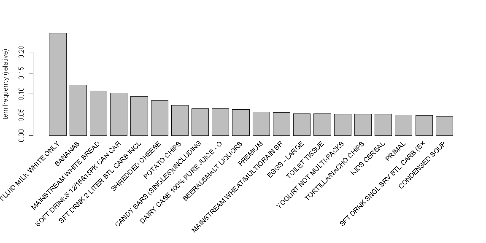
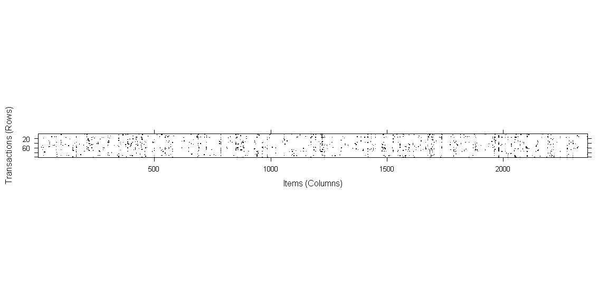

## Finding patterns using Association Rules

**Association rule** is a rule-based machine learning method for discovering interesting relations between variables in large databases.


```r
library(tidyverse)
library(arules)
```


#### Dowloading and loading the dataset
Detailed information of the dataset: [dunnhumby](https://www.dunnhumby.com/careers/engineering/sourcefiles) "The Complete Journey" <br>

Loading the data with transactions:


```r
data <- read_csv(transactional.data.path)
```

```
## Parsed with column specification:
## cols(
##   household_key = col_double(),
##   BASKET_ID = col_double(),
##   DAY = col_double(),
##   PRODUCT_ID = col_double(),
##   QUANTITY = col_double(),
##   SALES_VALUE = col_double(),
##   STORE_ID = col_double(),
##   RETAIL_DISC = col_double(),
##   TRANS_TIME = col_character(),
##   WEEK_NO = col_double(),
##   COUPON_DISC = col_double(),
##   COUPON_MATCH_DISC = col_double()
## )
```
<br>

Loading the list of `PRODUCTS` removing categories with low importance:

```r
products <- read_csv(product.path) %>%
    select(PRODUCT_ID, DEPARTMENT, COMMODITY_DESC, SUB_COMMODITY_DESC) %>%
    filter(!DEPARTMENT %in% c("ELECT &PLUMBING", "GM MERCH EXP", "KIOSK-GAS", "MISC SALES TRAN", "MISC. TRANS."
                             ,"PHARMACY SUPPLY", "POSTAL CENTER", "PROD-WHS SALES", "AUTOMOTIVE", "CHARITABLE CONT"
                             ,"CHEF SHOPPE", "CNTRL/STORE SUP", "COUP/STR & MFG", "DAIRY DELI", "DELI/SNACK BAR"
                             ,"FROZEN GROCERY", "GM MERCH EXP", "GRO BAKERY", "HBC", "HOUSEWARES", "KIOSK-GAS"
                             ,"MEAT-WHSE", "PHOTO", "PORK", "RX", "SALAD BAR", "TOYS", "VIDEO", "VIDEO RENTAL")
           ,COMMODITY_DESC != "NO COMMODITY DESCRIPTION"
           ,SUB_COMMODITY_DESC != "NO SUBCOMMODITY DESCRIPTION")
```

```
## Parsed with column specification:
## cols(
##   PRODUCT_ID = col_double(),
##   MANUFACTURER = col_double(),
##   DEPARTMENT = col_character(),
##   BRAND = col_character(),
##   COMMODITY_DESC = col_character(),
##   SUB_COMMODITY_DESC = col_character(),
##   CURR_SIZE_OF_PRODUCT = col_character()
## )
```
<br>

### Preparing data
Merging transactions and products' names; <br>
Saving as `.csv` to read later using `read.transactions()`


```r
data.prod <- data %>%
    inner_join(products, by = "PRODUCT_ID") %>%
    select(BASKET_ID, SUB_COMMODITY_DESC) %>%
    write_csv(tosave.path)
```
<br>

Converting dataframe to `sparse matrix`:


```r
transactions <- read.transactions(tosave.path
                                ,format = "single"  # the format of the dataframe is long, not wide
                                ,sep = ","
                                ,cols = c("BASKET_ID", "SUB_COMMODITY_DESC"))
```
<br>

Now we have the data ready to be used for `market basket analysis`
<br>

### Basic concepts

* **Support**
  * measures how frequently it occurs in the data
 $${support(X)} = {{count(X)} \over {N}}$$

* **Confidence**
  * measures the predictive power or accuracy
 $${confidence(X->Y)} = {{support(X,Y)} \over {support(X)}}$$

* **Lift**
  * measures how much likely one item is to be purchased relative to its typical purchase rate, given that you know another item has been purchased.
$${lift(X->Y)} = {{confidence(X,Y)} \over {support(Y)}}$$

### Descriptive analysis

General summary of items

```r
summary(transactions)
```

```
## transactions as itemMatrix in sparse format with
##  250204 rows (elements/itemsets/transactions) and
##  2361 columns (items) and a density of 0.003649654 
## 
## most frequent items:
##          FLUID MILK WHITE ONLY                        BANANAS 
##                          61383                          30326 
##         MAINSTREAM WHITE BREAD SOFT DRINKS 12/18&15PK CAN CAR 
##                          26846                          25667 
## SFT DRNK 2 LITER BTL CARB INCL                        (Other) 
##                          23472                        1988272 
## 
## element (itemset/transaction) length distribution:
## sizes
##     1     2     3     4     5     6     7     8     9    10    11    12 
## 42225 34462 25558 19538 15534 12564 10775  9195  7838  6885  6182  5315 
##    13    14    15    16    17    18    19    20    21    22    23    24 
##  4626  4220  3790  3453  3084  2701  2553  2340  2078  1951  1777  1679 
##    25    26    27    28    29    30    31    32    33    34    35    36 
##  1466  1404  1357  1199  1095   998  1004   896   779   772   713   658 
##    37    38    39    40    41    42    43    44    45    46    47    48 
##   625   590   559   464   466   440   381   332   301   310   266   253 
##    49    50    51    52    53    54    55    56    57    58    59    60 
##   259   194   194   174   158   163   159   117   128    98    87    74 
##    61    62    63    64    65    66    67    68    69    70    71    72 
##    85    63    59    52    40    43    50    38    34    30    19    25 
##    73    74    75    76    77    78    79    80    81    82    83    84 
##    15    18    10    13     9    11    17    10    12     9    10     4 
##    85    86    87    88    89    90    91    92    93    95    96    97 
##     8     5     4     4     5     8     7     2     3     2     4     2 
##    98    99   101   102   104   106   107   109   110   118   121   123 
##     1     2     1     2     1     1     2     1     3     1     1     1 
##   128 
##     1 
## 
##    Min. 1st Qu.  Median    Mean 3rd Qu.    Max. 
##   1.000   2.000   5.000   8.617  11.000 128.000 
## 
## includes extended item information - examples:
##                         labels
## 1 *ATH ACCES:TOWEL BARS/SOAP D
## 2 *ATTERIES:CAMERA/FLASH/WATCH
## 3        *BOYS/GIRLS MISC TOYS
## 
## includes extended transaction information - examples:
##   transactionID
## 1   26984851472
## 2   26984851516
## 3   26984896261
```
<br>

First 5 transactions

```r
inspect(transactions[1:5])
```

```
##     items                            transactionID
## [1] {BANANAS,                                     
##      CELERY,                                      
##      ONIONS SWEET (BULK&BAG),                     
##      ORGANIC CARROTS,                             
##      POTATOES RUSSET (BULK&BAG)}       26984851472
## [2] {GRAHAM CRACKERS,                             
##      HAMBURGER BUNS,                              
##      PEANUT BUTTER,                               
##      SPONGES: BATH HOUSEHOLD,                     
##      TRAY PACK/CHOC CHIP COOKIES}      26984851516
## [3] {EGGS - X-LARGE,                              
##      GRANOLA BARS,                                
##      GRND/PATTY - ROUND,                          
##      LINKS - RAW,                                 
##      SNACK CRACKERS}                   26984896261
## [4] {MAINSTREAM WHITE BREAD,                      
##      RAMEN NOODLES/RAMEN CUPS}         26984905972
## [5] {CHEWING GUM,                                 
##      INSIDE FROST BULBS,                          
##      SEASONAL CANDY BOX NON-CHOCOLA}   26984945254
```
<br>

Support level of the 3 first items

```r
itemFrequency(transactions[, 1:3])
```

```
## *ATH ACCES:TOWEL BARS/SOAP D *ATTERIES:CAMERA/FLASH/WATCH 
##                 3.996739e-06                 7.993477e-06 
##        *BOYS/GIRLS MISC TOYS 
##                 5.995108e-05
```
<br>

Items with at least 10% support level

```r
itemFrequencyPlot(transactions, support = 0.1)
```

<!-- -->
<br>

Top 20 support level items

```r
itemFrequencyPlot(transactions, topN = 20)
```

<!-- -->
<br>

Plotting sample of the sparse matrix

```r
image(sample(transactions, 100))
```

<!-- -->
<br>


### Creating the model

```r
transactions.rules <- apriori(transactions
    ,parameter = list(support = 0.003  # minimum support
    ,confidence = 0.25  # minimum confidence
    ,minlen = 2))  # minimum number of items per rule
```

```
## Apriori
## 
## Parameter specification:
##  confidence minval smax arem  aval originalSupport maxtime support minlen
##        0.25    0.1    1 none FALSE            TRUE       5   0.003      2
##  maxlen target   ext
##      10  rules FALSE
## 
## Algorithmic control:
##  filter tree heap memopt load sort verbose
##     0.1 TRUE TRUE  FALSE TRUE    2    TRUE
## 
## Absolute minimum support count: 750 
## 
## set item appearances ...[0 item(s)] done [0.00s].
## set transactions ...[2361 item(s), 250204 transaction(s)] done [0.97s].
## sorting and recoding items ... [592 item(s)] done [0.05s].
## creating transaction tree ... done [0.22s].
## checking subsets of size 1 2 3 4 done [0.22s].
## writing ... [2769 rule(s)] done [0.00s].
## creating S4 object  ... done [0.05s].
```
<br>
Model description

```r
summary(transactions.rules)
```

```
## set of 2769 rules
## 
## rule length distribution (lhs + rhs):sizes
##    2    3    4 
##  759 1797  213 
## 
##    Min. 1st Qu.  Median    Mean 3rd Qu.    Max. 
##   2.000   2.000   3.000   2.803   3.000   4.000 
## 
## summary of quality measures:
##     support           confidence          lift            count      
##  Min.   :0.003002   Min.   :0.2500   Min.   : 1.033   Min.   :  751  
##  1st Qu.:0.003385   1st Qu.:0.3204   1st Qu.: 2.551   1st Qu.:  847  
##  Median :0.004057   Median :0.4295   Median : 2.890   Median : 1015  
##  Mean   :0.005249   Mean   :0.4623   Mean   : 3.773   Mean   : 1313  
##  3rd Qu.:0.005591   3rd Qu.:0.6146   3rd Qu.: 3.701   3rd Qu.: 1399  
##  Max.   :0.062597   Max.   :0.8448   Max.   :50.003   Max.   :15662  
## 
## mining info:
##          data ntransactions support confidence
##  transactions        250204   0.003       0.25
```
<br>

Sorting by lift (first 100)

```r
# increase the number of rows (1:10) to see more results
inspect(sort(transactions.rules, by = "lift")[1:10])
```

```
##      lhs                               rhs                                support confidence     lift count
## [1]  {FLUID MILK WHITE ONLY,                                                                               
##       FROSTING}                     => {LAYER CAKE MIX}               0.003916804  0.7248521 50.00300   980
## [2]  {FLUID MILK WHITE ONLY,                                                                               
##       LAYER CAKE MIX}               => {FROSTING}                     0.003916804  0.5935796 48.07899   980
## [3]  {FROSTING}                     => {LAYER CAKE MIX}               0.008481079  0.6869537 47.38863  2122
## [4]  {LAYER CAKE MIX}               => {FROSTING}                     0.008481079  0.5850565 47.38863  2122
## [5]  {BABY FOOD JUNIOR ALL BRANDS}  => {BABY FOOD - BEGINNER}         0.003033525  0.4080645 46.55694   759
## [6]  {BABY FOOD - BEGINNER}         => {BABY FOOD JUNIOR ALL BRANDS}  0.003033525  0.3461012 46.55694   759
## [7]  {FLUID MILK WHITE ONLY,                                                                               
##       HAIR CONDITIONERS AND RINSES} => {SHAMPOO}                      0.003049512  0.6892502 40.36825   763
## [8]  {MEXICAN TACO TOSTADO SHELLS}  => {MEXICAN SEASONING MIXES}      0.003029528  0.5334272 39.32399   758
## [9]  {HAIR CONDITIONERS AND RINSES} => {SHAMPOO}                      0.006882384  0.6658933 39.00027  1722
## [10] {SHAMPOO}                      => {HAIR CONDITIONERS AND RINSES} 0.006882384  0.4030899 39.00027  1722
```
<br>


### Improving model
Removing products that are purchased too often


```r
nomilk.rules <- subset(transactions.rules, !items %in% c("FLUID MILK WHITE ONLY", "BANANAS", "MAINSTREAM", "SHREDDED CHEESE"))
```
<br>

#### Interesting findings:
* Those who buy <span style="color:blue">Preservers jam marmalade</span> are **`11.7`** times more likely to also buy <span style="color:green">Peanut butter</span>
* Those who buy <span style="color:blue">Bagels</span> are **`10.6`** times more likely to also buy <span style="color:green">Cream cheese</span>
* Those who buy <span style="color:blue">Skillet dinners</span> are **`9.3`** times more likely to also buy <span style="color:green">Tuna</span>
* Those who buy <span style="color:blue">Fruit snacks</span> are **`6.03`** times more likely to also buy <span style="color:green">Kids cereal</span>
* Those who buy <span style="color:blue">Hamburger buns</span> and `Soft drinks can` are **`4.8`** times more likely to also buy <span style="color:green">Potato chips</span>
<br>


```r
# increase the number of rows (1:10) to see more results
inspect(sort(nomilk.rules, by = "lift")[1:10])
```

```
##      lhs                               rhs                                support confidence     lift count
## [1]  {FROSTING}                     => {LAYER CAKE MIX}               0.008481079  0.6869537 47.38863  2122
## [2]  {LAYER CAKE MIX}               => {FROSTING}                     0.008481079  0.5850565 47.38863  2122
## [3]  {BABY FOOD JUNIOR ALL BRANDS}  => {BABY FOOD - BEGINNER}         0.003033525  0.4080645 46.55694   759
## [4]  {BABY FOOD - BEGINNER}         => {BABY FOOD JUNIOR ALL BRANDS}  0.003033525  0.3461012 46.55694   759
## [5]  {MEXICAN TACO TOSTADO SHELLS}  => {MEXICAN SEASONING MIXES}      0.003029528  0.5334272 39.32399   758
## [6]  {HAIR CONDITIONERS AND RINSES} => {SHAMPOO}                      0.006882384  0.6658933 39.00027  1722
## [7]  {SHAMPOO}                      => {HAIR CONDITIONERS AND RINSES} 0.006882384  0.4030899 39.00027  1722
## [8]  {BEANS GREEN: FS/WHL/CUT,                                                                             
##       CORN}                         => {PEAS GREEN}                   0.003125450  0.3061864 28.32128   782
## [9]  {BEANS GREEN: FS/WHL/CUT,                                                                             
##       PEAS GREEN}                   => {CORN}                         0.003125450  0.6201427 25.28307   782
## [10] {CORN,                                                                                                
##       PEAS GREEN}                   => {BEANS GREEN: FS/WHL/CUT}      0.003125450  0.5964912 21.83214   782
```


